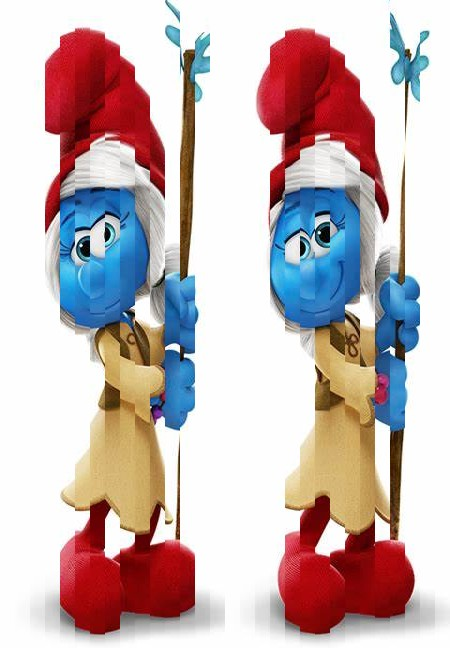
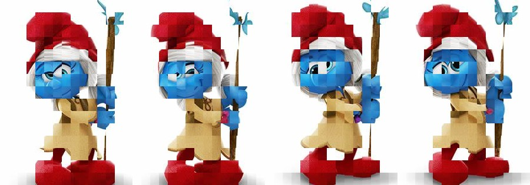

🌐 “Prove that we live in a simulation”

This script processes images by splitting them into vertical strips, rearranging those strips by odd and even indexes, then further manipulating the image by splitting it horizontally and stacking odd and even groups side by side.

## How It Works

1. **Vertical Strip Rearrangement**  
   The input image is divided vertically into a configurable number of equal-width strips. These strips are reordered so that all odd-indexed strips come first, followed by all even-indexed strips. This changes the horizontal layout of the image by rearranging its vertical slices.

2. **Horizontal Strip Grouping and Stacking**  
   The vertically rearranged image is then split horizontally into equal-height strips. All odd-indexed horizontal strips are stacked vertically into one group, and all even-indexed strips into another. These two vertical stacks are then placed side-by-side, forming the final transformed image.

## Configuration

- `VERTICAL_STRIP_COUNT`: Number of vertical (and horizontal) strips to divide the image into.
- Input and output directories and filenames are set in the `config.py` file.
- JPEG quality for output images is configurable.

## Usage

Place your input image in the configured input directory, then run the `process()` function. The output images will be saved in the output directory:

- A rearranged image with vertical strips reordered.
- The final image with horizontally stacked odd and even groups side by side.

## Requirements

- Python 3.x
- `numpy`
- `Pillow`

## Example

Given an image sliced vertically into strips labeled `[0, 1, 2, 3, 4, 5]`, after vertical rearrangement it becomes `[0, 2, 4, 1, 3, 5]`. Then the horizontally sliced strips are grouped and stacked to generate the final composite.

### Original picture

### After Vertical Strip Rearrangement

### After Horizontal Strip Rearrangement

